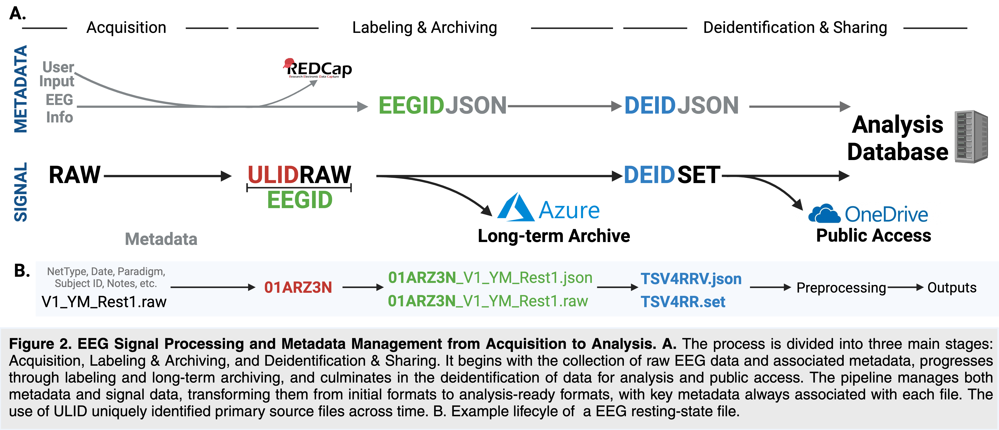

# EEG Signal Processing and Metadata Management Pipeline

## Overview

This project implements a comprehensive pipeline for processing EEG (Electroencephalogram) signals and managing associated metadata from acquisition to analysis. The pipeline is designed to ensure data integrity, facilitate long-term archiving, and enable secure sharing and analysis of EEG data.

## Pipeline Stages

The process is divided into three main stages:

1. **Acquisition**
2. **Labeling & Archiving**
3. **Deidentification & Sharing**

### 1. Acquisition

- Collects raw EEG data (RAW files)
- Gathers associated metadata (User Input, EEG Info)
- Integrates with REDCap for initial data management

### 2. Labeling & Archiving

- Assigns a ULID (Universally Unique Lexicographically Sortable Identifier) to each raw file
- Creates EEGID JSON files containing metadata
- Generates ULIDRAW files (raw data with ULID prefix)
- Stores data in long-term archive on Azure

### 3. Deidentification & Sharing

- Produces DEIDJSON files (deidentified metadata)
- Creates DEIDSET files (deidentified EEG data)
- Stores analysis-ready data in an Analysis Database
- Facilitates public access through OneDrive

## File Naming Convention

Example lifecycle of an EEG resting-state file:

1. Initial: `V1_YM_Rest1.raw`
2. ULID assigned: `01ARZ3N_V1_YM_Rest1.raw`
3. Metadata JSON: `01ARZ3N_V1_YM_Rest1.json`
4. Deidentified: `TSV4RR.set` (data), `TSV4RRV.json` (metadata)

## Key Components

- **ULID**: Ensures unique identification of primary source files across time
- **REDCap**: Used for initial data input and management
- **Azure**: Provides long-term archiving solution
- **OneDrive**: Enables public access to deidentified datasets

## Metadata Management

The pipeline tracks various metadata throughout the process, including:
- NetType
- Date
- Paradigm
- Subject ID
- Notes
- Other relevant EEG information

## Contributing
We welcome contributions to the EEG Signal Processing and Metadata Management Pipeline project! Here are some guidelines to help you get started:

Fork the Repository: Start by forking the project repository to your GitHub account.
Create a Branch: Create a new branch for your feature or bug fix.
Code Style: Follow the existing code style. We recommend using PEP 8 for Python code.
Documentation: Update the documentation, including README.md and inline comments, to reflect your changes.
Testing: Add or update tests as necessary. Ensure all tests pass before submitting your changes.
Commit Messages: Write clear, concise commit messages. Start with a brief summary line, followed by more detailed explanations if necessary.
Pull Request: Submit a pull request from your branch to our main repository. Provide a clear description of the changes and any relevant issue numbers.
Code Review: Be open to feedback and be responsive to comments on your pull request.
Sign Your Work: Include a sign-off in your commit messages to certify that you have the right to submit the work under the project's license.

For more detailed information, please see our CONTRIBUTING.md file.

## License

MIT License

## Contact

ernest.pedapati@cchmc.org
